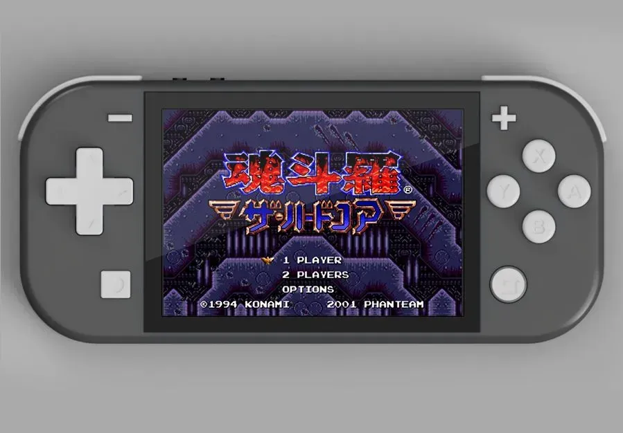
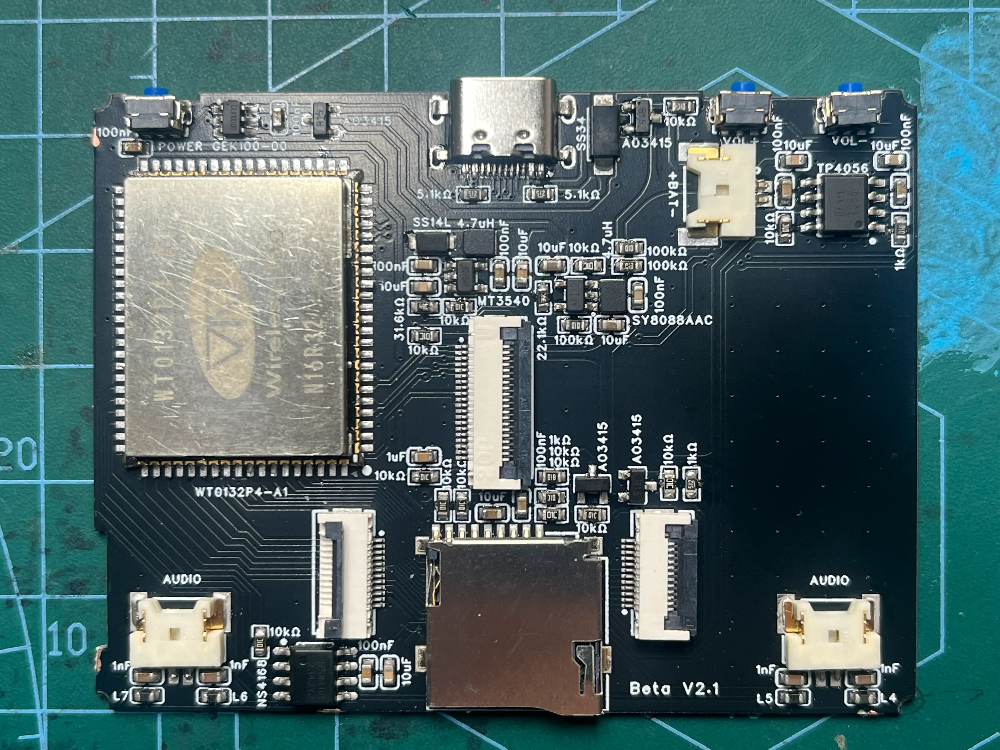
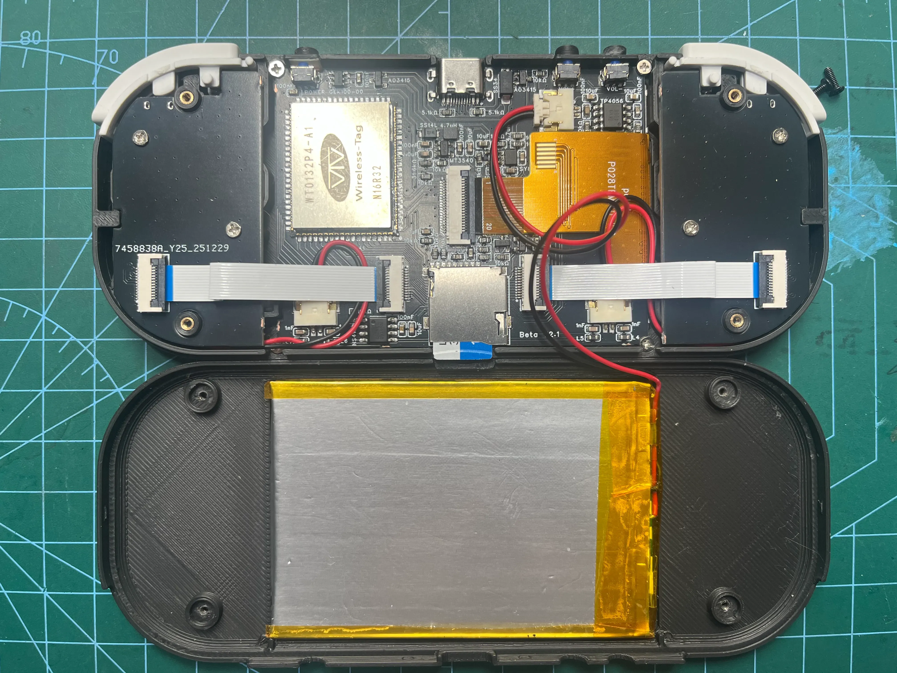
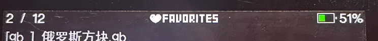
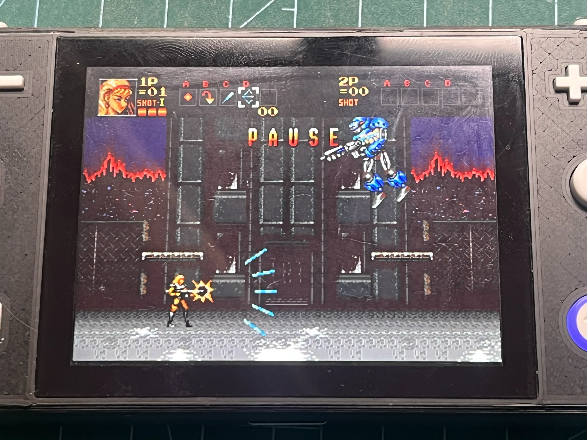
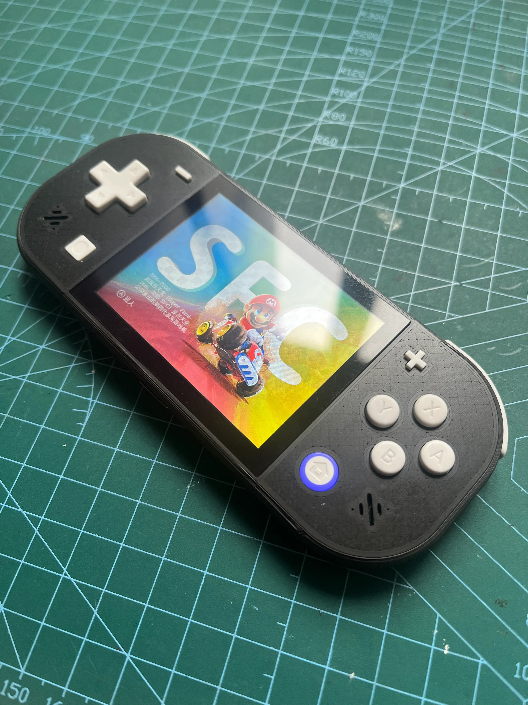
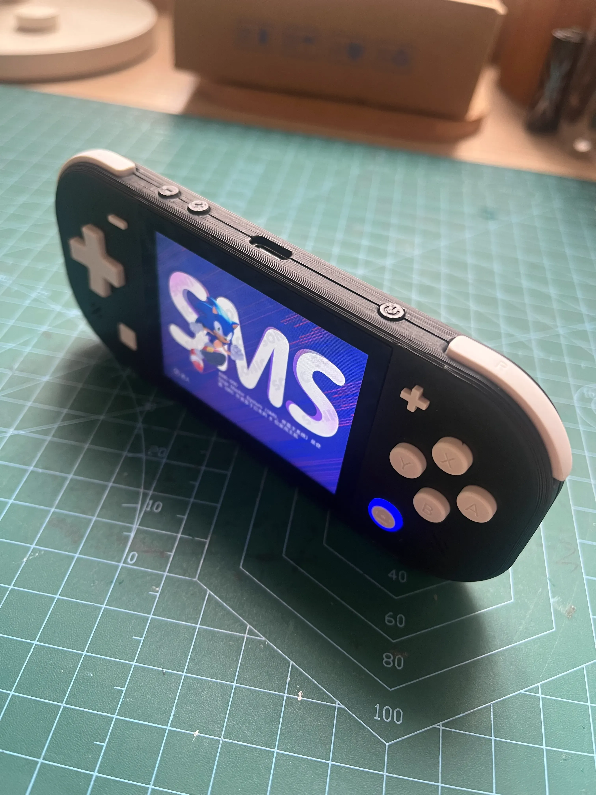
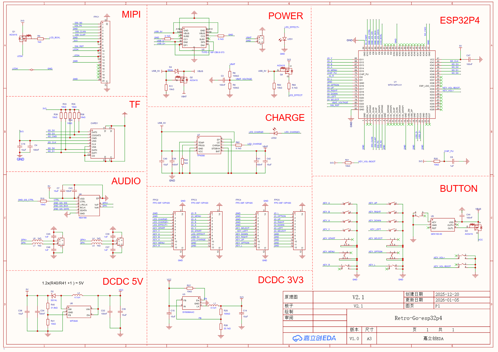
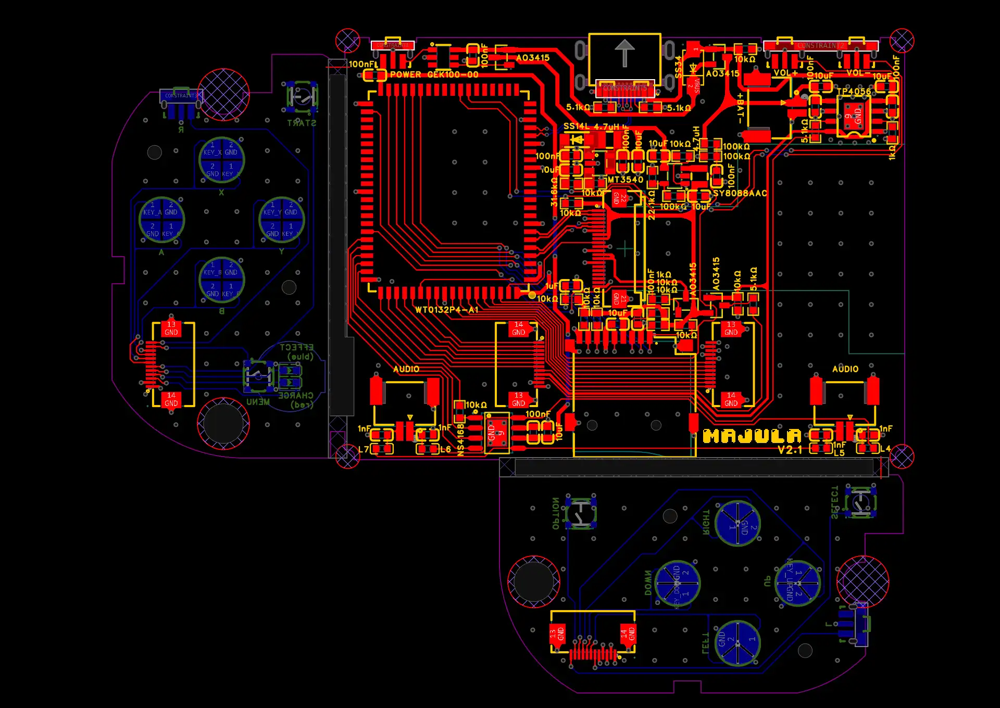

**申明本仓库非原作者，为复刻爱好者基于Bardo 大佬的工程，适配了软件。和原作者软件并不相同！！！**

详细参考：

[oshwhub.com/bardo/majula-fu-gu-you-xi-zhang-ji](https://oshwhub.com/bardo/majula-fu-gu-you-xi-zhang-ji)

Majula复古游戏掌机

[ESP系列](https://oshwhub.com/explore?tag=6f6eefa0fcb54ab4b75469c64646d9e9&jspm=hub.gc.tb.bq1&jlc_vid=TlRdVwdfQFRaVgJfRldZAgVfQwBeAgVXFFddUF0HRQMxVlNeQVVXX1deR1ZZUTsOAxUeFF5JWA4dDxMOAgNABAsLWAMPFQAJWBMLExYJWgYBSgEVB1JcFFdLRUxbVkkUEg0LBhcD)[DIY设计](https://oshwhub.com/explore?tag=d3cacd30fc1a4dbea35aba2f00c755e3&jspm=hub.gc.tb.bq2&jlc_vid=TlRdVwdfQFRaVgJfRldZAgVfQwBeAgVXFFddUF0HRQMxVlNeQVVXX1deR1ZZUTsOAxUeFF5JWA4dDxMOAgNABAsLWAMPFQAJWBMLExYJWgYBSgEVB1JcFFdLRUxbVkkUEg0LBhcD)[开源复刻](https://oshwhub.com/explore?tag=935421b496b44f178a554fbdaa568e0a&jspm=hub.gc.tb.bq3&jlc_vid=TlRdVwdfQFRaVgJfRldZAgVfQwBeAgVXFFddUF0HRQMxVlNeQVVXX1deR1ZZUTsOAxUeFF5JWA4dDxMOAgNABAsLWAMPFQAJWBMLExYJWgYBSgEVB1JcFFdLRUxbVkkUEg0LBhcD)

简介：esp32p4主控，2.8寸640x480MIPI屏幕，retro go系统

## 开源协议

：### GPL 3.0

**创建时间：2026-01-07 13:54:22**更新时间：2026-06-05 13:44:39

## 描述

#### 首先感谢 **[longxiangam大佬的开源项目](https://oshwhub.com/longxiangam/esp32p4_game?jlc_vid=TlRdVwdfQFRaVgJfRldZAgVfQwBeAgVXFFddUF0HRQMxVlNeQVVXX1deR1ZZUTsOAxUeFF5JWA4dDxMOAgNABAsLWAMPFQAJWBMLExYJWgYBSgEVB1JcFFdLRUxbVkkUEg0LBhcD)** ，本项目使用了他分享的屏幕驱动、中文显示等代码，并在我的[Katarina掌机](https://oshwhub.com/bardo/retro-go-esp32s3-2-51-release?jlc_vid=TlRdVwdfQFRaVgJfRldZAgVfQwBeAgVXFFddUF0HRQMxVlNeQVVXX1deR1ZZUTsOAxUeFF5JWA4dDxMOAgNABAsLWAMPFQAJWBMLExYJWgYBSgEVB1JcFFdLRUxbVkkUEg0LBhcD)基础上，做了很多改进

了解更多详情和完整资料，欢迎加入我的基友Q群860928540

视频介绍：[https://www.bilibili.com/video/BV14s6SBDEGr/?vd_source=32704cec22311b37cf626be30a817df0](https://www.bilibili.com/video/BV14s6SBDEGr/?vd_source=32704cec22311b37cf626be30a817df0)

## 硬件上：

1. 主控使用esp32p4，性能相较于esp32s3有所提升
2. 采用2.8寸640x480高分辨率屏幕，接口为MIPI
3. 增加音量键
4. 使用switch lite按键，因此增加了X、Y、L、R键位
5. 将电源开关由拨动开关改为轻触开关，开关机更加从从容容！
6. LED灯光
7. 双喇叭
8. 更大的电池

## 外观上：

1. 为了配合swith lite按钮，外观设计也如同迷你版的swith lite
2. 仍然保持了非常小巧的机身，机身厚度仅12mm
3. LED灯光开机蓝色，充电时会显示成红色
4. 立创定制面板，让外观更精致
5. 3D打印的外壳，就这个拉跨，可它便宜啊！

## 设计图

V2.1

原理图

